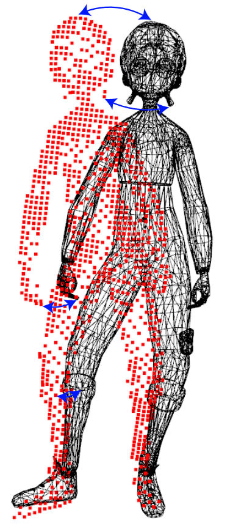
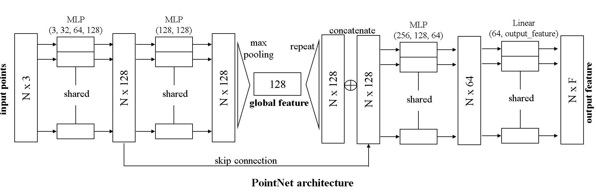
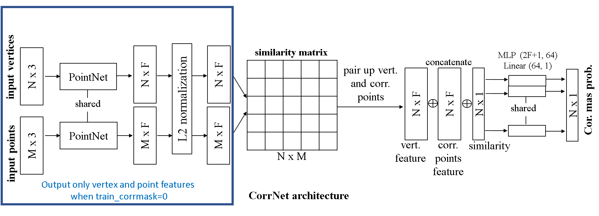
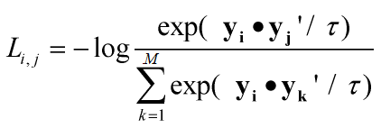

# Assignment 3: Point descriptors and alignment
In this assignment you will learn to implement a neural network architecture for processing point clouds and mesh vertices with PyTorch.

Figure 1. A polygon mesh of a human figure, shown as a black wireframe mesh, and a partial point cloud shown as red. A few correspondences are highlighted with blue arrows.

---

# Overview

Given an input polygon mesh of a 3D character and a point cloud representing a similar human, your goal is to compute:
1. per-vertex descriptors for the mesh and per-point descriptors for the point cloud.
2. use these descriptors to compute correspondences between mesh vertices and points in the point cloud.
3. compute a correspondence mask, which is 1 for a mesh vertex that has a corresponding point, and 0 for a mesh vertex with no correspondence. The point cloud captures only the front of a human, thus the mask filters out the mesh vertices that don't have correspondences.
4. use these correspondences to compute a rotation matrix that best aligns the point cloud with the mesh.

To perform the tasks above, you will use a neural network architecture based on [PointNet](https://arxiv.org/abs/1612.00593). The assignment provides you with a (toy) training dataset consisting of 60 pairs of meshes and point clouds (human at different poses). The dataset also contains a hold-out validation dataset with 20 pairs, and test dataset of 20 pairs where you will evaluate your network on each pair.

---

# Tasks

## Task A (25%)

---

Change the PointNet class in "model.py" so that it defines the following PointNet:

(Note: You will use the same PointNet to process both the point cloud and mesh.)

- The module takes as input a set of points (Nx3) represented by their 3D positions, which can either be the mesh vertices or the points from the point cloud. The output is a descriptor, or in other words, a feature representation for each input point (or vertex).
- Each point i is first transformed to a 128-dimensional representation f_i through a MLP with 3 hidden layers consisting of 32, 64, 128 nodes. Each hidden layer uses a leaky ReLU activation and group normalization.
- Another MLP with a single hidden layer of 128 nodes processes each point representation into the 128-dimensional representation h_i.
- A max pooling layer collapses the point representations into a global shape 128-dimensional representation g.
- Then the representations f_i are concatenated with g resulting in a new per-point 256-dimensional representation [ f_i, g ].
- This is transformed into the final output, per-point descriptor y_i through a MLP and a linear transformation layer.
- The dimension of the output descriptor is 32-dimensional.

---

## Task B (25%)

---

Change the CorrNet class in "model.py" so that it defines the following network for computing descriptors for both the point cloud and mesh, then use those to compute the correspondence mask:

- The module CorrNet has a parameter (flag) called train_corrmask:
    - When 0, the module outputs a NxF matrix Y storing the per-vertex point descriptors from the mesh as well as the MxF matrix Y' storing the per-point point descriptors from the point cloud (N is the number of vertices, M is the number of points, F=32 the descriptor dimensionality). Both descriptors should be extracted by the same PointNet module. The per-point and per-vertex descriptors should then be L2-normalized.
    - When 1, the module also outputs a correspondence mask. Specifically, use the cosine similarity to create a similarity matrix |V|x|P| where each entry (v,p) stores the similarity of vertex v with point p. Then for each vertex v, you will find the most similar point in the point cloud and store it in an array n (i.e. n[ v ] returns the most similar point to v according to the above similarity matrix).
- The module also has a hyperparameter num_output_features, which represents the resulting per-{vertex|point} descriptor dimensionality.
- Then concatenate the following matrices (a) the NxF matrix Y storing the per-vertex mesh descriptors, (b) the NxF matrix X storing for each row, the descriptor of the point n[ i ] of the point cloud, (c) the Nx1 vector S storing the similarity of (i, n[ i ]) from the above similarity matrix. The result is a new matrix with dimensionality Nx(2F+1). Transform this matrix into a Nx1 correspondence mask through a MLP with one hidden layer of 64 nodes applied to each row, followed by a linear transformation layer that outputs a per-vertex correspondence confidence.

---

## Task C (15%)

---

Change the code in "train.py" (function NTcrossentropy) to implement a loss for training the CorrNet and PointNet such that they output descriptors that are as similar as possible for ground-truth corresponding points (i,j) between the mesh and the point cloud, and different for non-corresponding pairs.
- The function takes as input the NxF matrix Y storing the per-vertex mesh descriptors (vtx_feature), and the MxF matrix Y' (pts_feature) storing the per-point point descriptors from the point cloud.
- It also takes as input a Kx2 matrix (corr) whose each entry stores the ground-truth correspondence pairs (i,j).
- Note that their number of pairs can be different for each training pair of mesh and point cloud.
- The loss for a ground-truth corresponding pair (i,j) ("positive pair") should be the following one, a form of "Normalized Temperature-scaled Cross Entropy Loss" [https://paperswithcode.com/method/nt-xent]:

    
    
    where (i,j) is the ground-truth corresponding pair, y_i is the descriptor of vertex i, y_i' is the descriptor of point j corresponding to vertex i, y_k' is the descriptor of (any) point k in the point cloud. The temperature of t is used to scale the cosine similarities (set to 0.07 in the starter code). The loss should be summed over all corresponding pairs.

---

## Task D (10%)

---

At each training epoch, the starter code evaluates the accuracy of correspondences, and the accuracy of the correspondence mark (see calc_matching_accuracy, calc_mask_accuracy). Train the architecture with train_corrmask=0, and report the correspondence (matching) accuracy at distance thresholds 0.01, 0.02, 0.04 (see distance_threshold input parameter) at the best epoch (epoch with the highest hold-out validation accuracy). Then train the architecture with train_corrmask=1 and report the correspondence mask accuracy (one value) at the best epoch. Include all the above values in a README.TXT file in your ZIP submission.

---

## Task E (25%)

---

At each training epoch, the starter code calls the function fit_rotation. The function is supposed to compute the optimal rotation matrix aligning each point cloud to the mesh. Use the material from the alignment lecture (i.e. computation of optimal rotation through SVD) to compute the optimal rotation aligning each point cloud to the mesh based on the predicted correspondences and mask. You should use "reliable" correspondences i.e. correspondences where the confidence mask is high (above 0.5). The starter code already computes the Euler rotation angles based on the rotation matrix you provide. The angles are averaged over all pairs of test meshes and point clouds (all point clouds are rotated wrt the mesh using the same amount of rotation). Report the 3D rotation angles for the test set at the best epoch in your README.TXT

---