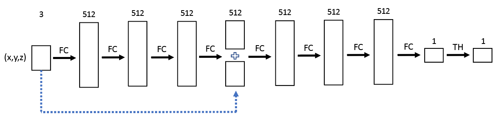

# Assignment 4: Neural Surface Reconstruction from Point Clouds
In this assignment you will implement a neural implicit surface reconstruction algorithm to approximate a surface represented by scattered point data.

---

# Overview

The problem statement is the same as assignment 1: given a set of points `P = { p1, p2, ... , pn }` that represent a point cloud, we will define an implicit function `f(x, y, z)` that represents a signed distance to the surface approximated by these points. The surface is extracted at `f(x, y, z) = 0` using the marching cubes algorithm. In this assignment, you will implement a more advanced approach to implicit surface reconstruction based on a deep neural network (DeepSDF).

The dataset is the same as assignment-1.

---

# Tasks

## Task A (50%)

---

You will first implement the architecture and forward pass in "model.py" based on the DeepSDF paper [learning Continuous Signed Distance Functions for Shape Representation, CVPR 2019](https://arxiv.org/abs/1901.05103) for neural implicit-surface reconstruction. More specifically, given a set of 3D point samples `P'` and their SDF values `S = { s1, s2, ... , sn }`, we train the parameters `θ` of a multi-layer fully-connected neural network `fθ` on (`P'`, `S`) to make `fθ` an effective SDF approximator:

`si = fθ(  pi' ),      pi' ∈ P',    si ∈ S`

The network architecture is shown in the following figure. It takes as input the sample point coordinate `pi'=(x,y,z)` and passes it through 8 fully-connected layers (FC in figure). The size of the vector representaton in each hidden layer has size 512 as shown in the figure. Note that after the fourth FC layer, the layer outputs the hidden vector with 509-dim, which is concatenated with the original 3-dim point coordinate `(x, y, z)` to form the final 512-dim vector (see blue dashed line in the figure). In the first seven FC layers (i.e., except the last), a weight normalization layer is appended (`nn.utils.weight_norm`), then a PReLu non-linear activation layer with a common learnable slope for all channels and a dropout layer (`dropout rate=0.1`) are added. Finally, the predicted SDF value is obtained with the last FC layer which transforms the vector dimension from 512 to 1 and another tanh activation layer (denoted as TH in the figure).

---

## Task B (25%)

---

Complete the code in "train.py" that implements the training procedure. The training is done by minimizing the sum over losses between the predicted and real SDF values of sample points under the clamped L1 loss function:

`L(fθ(pi'), si) = |clamp(fθ(pi'), σ) - clamp(si , σ)|`

where `clamp(t, σ)` clamps `t` within the limits `(-σ, σ)`

(Note: in this implementation, `σ = 0.1`).

---

## Task C (20%)

---

The sampling of training points and their SDF values should be impemented in "utils.py". The training 3D points are sampled around the given surface points of the point cloud along their normal directions: `pi' = pi + ε ⋅ ni` where `ε` is randomly sampled from a Gaussian distribution `N(0, 0.05^2)`. For each point `pi`, create a set of 100 different samples `{pi'}` for training and validation set.

The neural network weights are optimized by the AdamW optimizer, as specified in the starter code. The default learning rate is set to `0.0001`, weight decay is set to `0.0001`. The network is trained for 100 epochs with `batch size = 512`. The loss for training and validation set are reported per epoch. The starter code saves the best model with the lowest loss on the validation set. Detailed training hyper-parameters can be found in the training code argument parser.

---

## Task D (5%)

---

Show screenshots of the reconstructed bunny (500 and 1000 points) and sphere after training your best model for each of these objects in a PDF report.

---